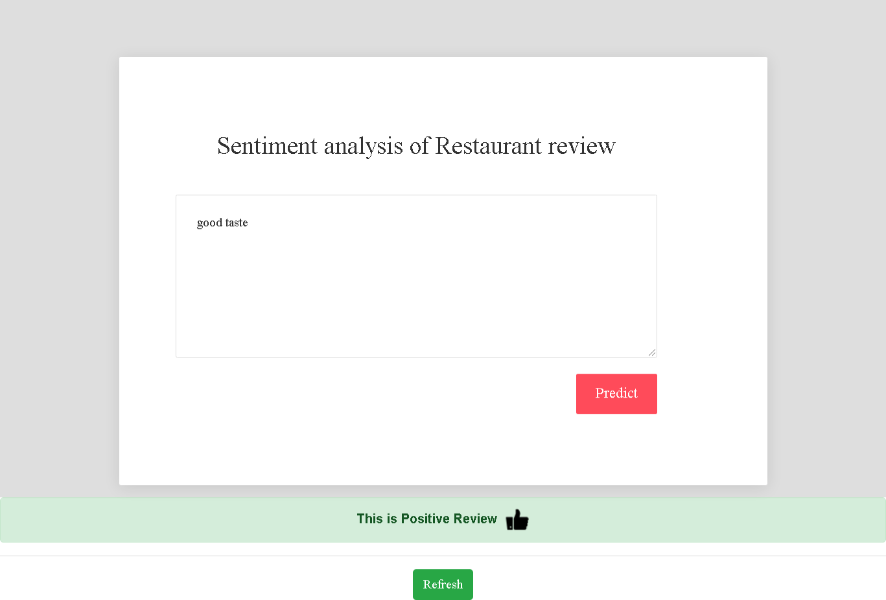

# Sentiment Analysis of Resturant Review
   


## Table of Content
  * [Introduction](#introduction)
  * [Demo](#demo)
  * [Overview](#project-overview)
  * [DataSet](#data)
  * [Dependencies](#dependencies)
  * [Local Installation](#local-installation)
  * [Extracting reviews](#extracting-reviews)
  * [Training and classification](#training-and-classification)
  * [Results](#results)
  * [Scope for Improvement](#scope-for-improvement)
  

### **Introduction**

- This project is to create a tool to predict sentiment of the customer from the analysing reviews they have posted in the comment box.

- Natural language processing and machine learning is applied to extract actionable insights from the customer reviews about their experiences.
- If restaurant owners can gauge user sentiment about their restaurant, areas where their business is lacking, which dishes are doing well and what users are saying about their competitors - they can take appropriate steps to improve their business.


## Demo


<p align='center'>
 
 
 </p>


## Project Overview 

The high-level sequence involved in processing is as follows:

1) Raw data collection from kaggle

2) Sentiment labeling

3) stop words, stemming, Bag of Words, vectorization

4)	Transform into train/test sets for classifier

5) Check with metrics of different Alogrithm  and select model with least error


### **Data**

Dataset will be a collection of 1000 reviews of a restaurant downloaded from kaggle. We’ll use NLP to predict whether a review is positive or negative.

It includes the data

- The dataset is a .tsv (Tab Separated Values) file, with two columns- one with the reviews and another with the review class, i.e., positive (1) or negative (0).


### **Dependencies**

**Python Version:** 3.7  
**Packages:** pandas, numpy, matplotlib, seaborn, NLTK


## Local Installation
1. Clone the Repo by going to your local Git Client and pushing in the command: 
```sh
https://github.com/diwakarDrs/NLP_Restaurant-Reviews-Sentiment-Analysis.git
```
2. Install the Packages: 
```sh
pip install -r requirements.txt
```
3. At last, push in the command:
```sh
python app.py
```
4. Go to ` http://127.0.0.1:5000/` and to view the application

**Defining Sentiment**

For the purpose of project, we define sentiment to be &quot;a personal positive or negative feeling.&quot; Here are some examples:

| **Sentiment** | **Review** |
| --- | --- |
| Positive | The food here is very good. |
| Negative | I am never coming to this restaurant again. The food was tasteless. |

## Extracting reviews

**Removal of Stop Words**
- Stop words are the words which are commonly used. For example, we don't need words such as 'is','the','and','a’in our text since they do not help in determining whether the review is good or bad. 
- Next, *Stemming* process which reduces the words to it's root word. It simply removes suffixes/prefixes.

**Creating a 'Bag of Words’**
- Next, we apply vectorization to convert the reviews into a numerical format for weightage of the word.
- We create a sparse matrix containing individual reviews as rows and each word of the reviews as columns. We call this the Bag of Words. Our text is now ready for training.

## Training and classification

- The data is split into two parts, train and test with 75% in train and 25% in test. 
- The classification models we used are
**MultinomialNB** : Accuracy = 73.6%, 
**MLPClassifier ** : Accuracy = 69.6%, 
**SVC ** : Accuracy = 69.6%, 
**GaussianNB ** : Accuracy = 71.2%, 
**LogisticRegression ** : Accuracy = 70%, 
**DecisionTreeClassifier ** : Accuracy = 64%, 
**RandomForestClassifier ** : Accuracy = 68%. 

## **Results**

The MultinomialNB have higher accuracy than the other approaches on the test and validation sets with the Precision score of 76% and Recall score of 74%

Although the accuracy may seem to be low, it is pretty good for the input of 1000 reviews. With an increase in the number of reviews, the accuracy of the model will increase.

##  Scope for Improvement

-  [ ] Getting data from databases.
- [ ] Deploying the Web Application on Cloud platform.
- [ ] Development using RNN.
- [ ] Set the Application on Docker.

